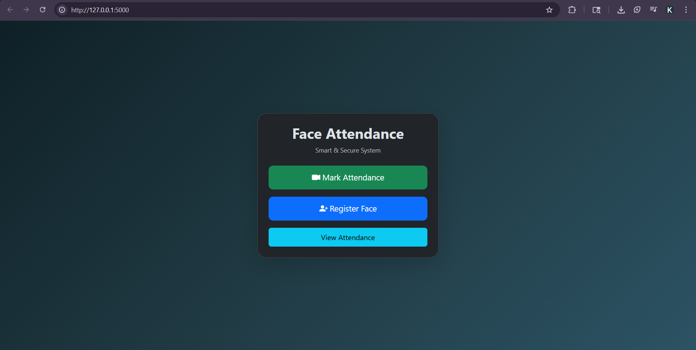

# Smart-Attendance-System-Using-Face-Recognition

## 📌 Overview
This project is a face recognition-based attendance system built using Python and Flask. It detects faces in real-time and automatically marks attendance.

## 🚀 Features
- Register new user faces
- Mark attendance using face recognition
- Prevent duplicate attendance
- View attendance by date
- Real-time webcam detection

## 🛠️ Technologies Used
- Python
- Flask
- OpenCV
- NumPy
- SQLite

## ▶️ How to Run the Project

### 1. Clone the repository
git clone https://github.com/Karan23207/Smart-Attendance-System-Using-Face-Recognition.git

### 2. Go to project folder
cd Smart-Attendance-System-Using-Face-Recognition

### 3. Create virtual environment (recommended)
python -m venv .venv

### 4. Activate virtual environment

For Windows:
.venv\Scripts\activate

For Mac/Linux:
source .venv/bin/activate

### 5. Install dependencies
pip install -r requirements.txt

### 6. Run the project
python app.py

### 7. Open in browser
http://127.0.0.1:5000

## ⚠️ Notes
- Make sure your webcam is connected
- Press 'S' to capture face while registering
- Do not register the same user twice

## 📷 Project Screenshots

Below are real-time outputs of the system demonstrating functionality:

### 🏠 Home Page

### 📝 Register Face

### ⚠️ Duplicate User Detection

### ✅ Attendance Marked

### 📊 View Attendance

